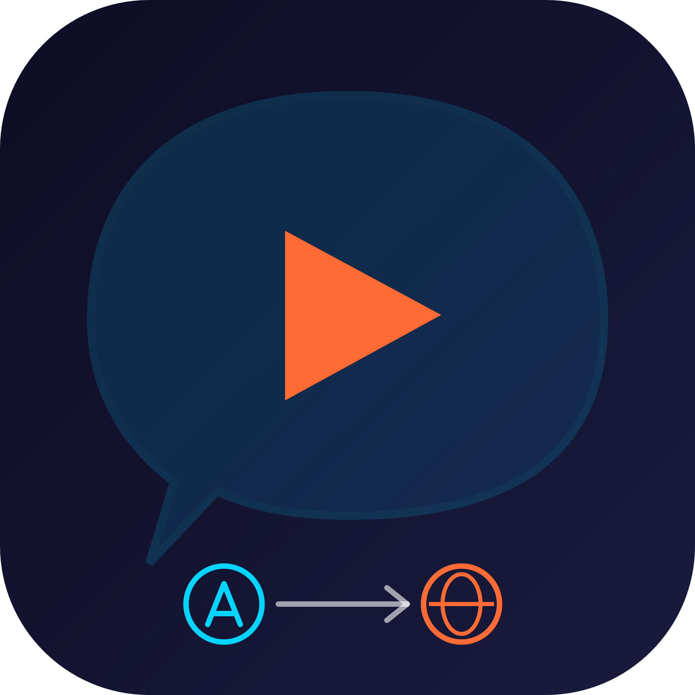
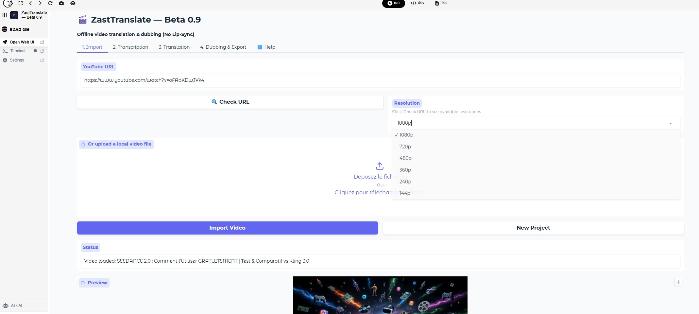
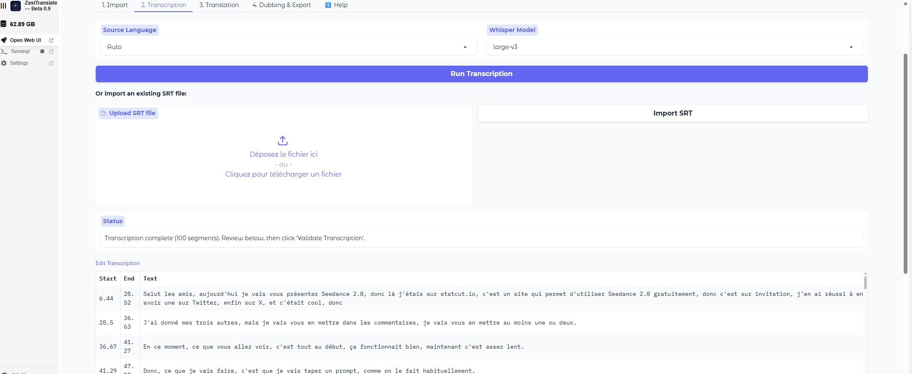
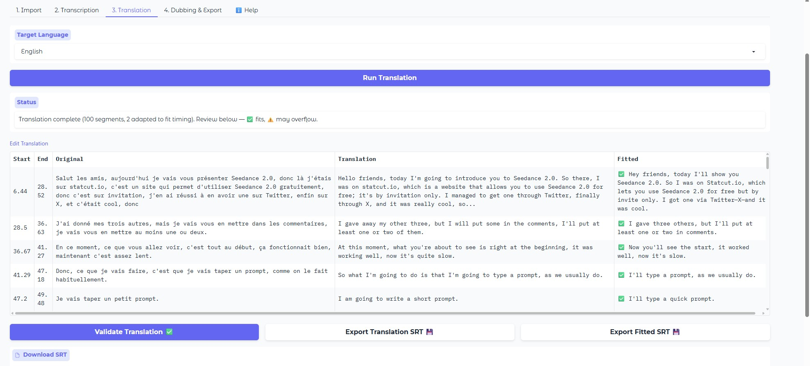
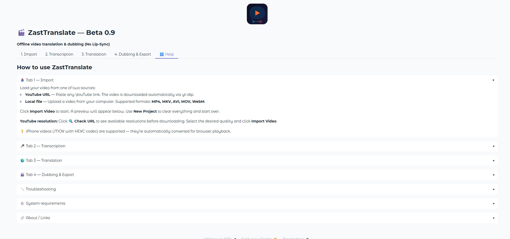

<p align="center">
  
</p>

# ZastTranslate — Beta 0.9

**1-click video translation & dubbing for [Pinokio](https://pinokio.computer)** — 100% local, AI voice cloning, zero API keys.

> ⚠️ **Beta 0.9**: This software is under active development. Tested on **Windows only**. Some features may change.

Translate any video into 10 languages with natural-sounding dubbed audio. Optionally clone the original speaker's voice for seamless dubbing. Everything runs locally on your machine — no cloud, no subscriptions.

## Features

- 🎬 **Input**: YouTube URL (with resolution picker) or local video file
- 🎙️ **Transcription**: WhisperX with word-level timestamps — 20+ source languages
- 🌍 **Translation**: Qwen3-8B LLM — 10 target languages (limited to Qwen3-TTS dubbing support)
- 🗣️ **Voice Cloning**: Qwen3-TTS zero-shot voice cloning from original audio or uploaded sample
- 🔊 **Smart Dubbing**: Auto-adjusts text length & speech speed to match original timing
- 🎵 **Audio Separation**: Demucs isolates vocals from background music/FX, then remixes with dubbed voice
- 📝 **Editable**: Review and edit transcription & translation before dubbing
- 📦 **Export**: Final MP4 video + SRT subtitles
- 🗑️ **Cleanup**: "New Project" deletes all temporary files to free disk space

### Current limitations

- 🎭 **No lip-sync** — The dubbed audio replaces the original voice track but the video is not modified (no face/lip adaptation)
- 🗣️ **Single voice only** — All segments are dubbed with the same voice. Multi-speaker support is not available yet

## Installation (Pinokio)

1. Open **Pinokio**
2. Navigate to this repository
3. Click **Install** — sets up Python environment, PyTorch CUDA, Qwen3-TTS voice cloning, and all dependencies
4. Click **Start** — launches the Gradio web interface

## Usage

### Step 1 — Import

Load your video from one of two sources:

- **YouTube URL** — Paste any YouTube link. The video is downloaded automatically.
- **Local file** — Upload a video from your computer. Supported formats: **MP4, MKV, AVI, MOV, WebM**.



> 💡 iPhone videos (.MOV with HEVC codec) are fully supported — they're automatically converted for browser playback.

### Step 2 — Transcription

This step separates vocals from background music (Demucs), then transcribes the speech (WhisperX).

| Option | Description |
|---|---|
| **Source Language** | Select the spoken language, or leave on *Auto* for detection. Manual selection improves accuracy. |
| **Whisper Model** | `base` (fast), `small`/`medium` (balanced), `large-v3` (best accuracy, ~3 GB VRAM) |



After transcription, review and edit the table (Start, End, Text).

> ⚠️ **You must click "Validate Transcription" before going to the Translation tab.** Without validation, the next step will not have any data.

You can also **import an existing SRT file** instead of running transcription.

### Step 3 — Translation

Select the target language and click **Run Translation**. The app generates two versions:

- **Translation** — Natural, full translation (faithful to the original meaning)
- **Fitted** — Concise version shortened to fit segment duration for dubbing (✅ = fits, ⚠️ = may overflow)



Both columns are editable. The **Fitted** column is what will be spoken during dubbing.

> ⚠️ **You must click "Validate Translation" before going to the Dubbing tab.** Without validation, dubbing will not work.

**Export options:** Export Translation SRT (full) or Export Fitted SRT (dubbing-ready).

Supported languages (limited to Qwen3-TTS dubbing support):

| Language | Language |
|---|---|
| 🇫🇷 Français | 🇯🇵 Japanese |
| 🇬🇧 English | 🇰🇷 Korean |
| 🇪🇸 Español | 🇨🇳 Chinese (Simplified) |
| 🇩🇪 Deutsch | 🇷🇺 Russian |
| 🇮🇹 Italiano | 🇧🇷 Português |

### Step 4 — Dubbing & Export

Generate the dubbed video with synthesized speech.

### Voice modes

| Mode | Description | When to use |
|---|---|---|
| **Default voice** | Qwen3-TTS preset voice | Quick dubbing, no reference needed |
| **Clone from original** | Clones the speaker's voice from the extracted vocals | Best result — sounds like the original speaker |
| **Clone from file** | Uses an uploaded WAV/MP3 file as voice reference | When you want a specific voice (10-30s of clear speech) |

> 💡 Voice cloning uses the Qwen3-TTS model, installed automatically during setup.

**🔊 Never Cut Vocal** mode speaks all text in full without truncation. Produces more natural speech but dubbing may drift out of sync with the video.

**Output:** Final dubbed MP4 video + mixed audio (downloadable as WAV).


### ℹ️ Help tab

The built-in Help tab provides detailed usage instructions, troubleshooting tips, and system information.



## Requirements

- **GPU**: NVIDIA GPU with 4+ GB VRAM recommended (CUDA)
- **CPU**: Works on CPU but significantly slower
- **Disk**: ~8 GB for models (downloaded on first use)
- **OS**: **Tested on Windows only**. May work on Linux/macOS but untested.

## API (Programmatic Access)

### Python

```python
from modules.transcriber import Transcriber
from modules.reformulator import Reformulator
from modules.tts_engine import TTSEngine

# Transcribe
transcriber = Transcriber()
segments = transcriber.transcribe("video.mp4", language="en")

# Translate (Qwen3-8B — translates + fits text to timing in one pass)
reformulator = Reformulator()
reformulator.load_model()
translated = reformulator.translate_segments(segments, source_lang="en",
    target_lang_name="French", target_lang_code="fra_Latn", cps=13)

# Synthesize with voice cloning
tts = TTSEngine()
tts.load_model(voice_path="reference_voice.wav")
result = tts.synthesize_segment("Bonjour le monde", "fra", "output.wav", voice_path="reference_voice.wav")
```

### cURL (Gradio API)

```bash
# When running, the Gradio API is available at the displayed URL
curl -X POST http://localhost:7860/api/predict \
  -H "Content-Type: application/json" \
  -d '{"data": ["https://youtube.com/watch?v=..."]}'
```

## Troubleshooting

- **Models download on first run** — WhisperX, Qwen3-8B, Demucs, and TTS models are cached in HuggingFace's default cache directory
- **Out of VRAM**: Models are loaded/unloaded sequentially to minimize memory usage
- **Clean install**: Click **Reset** then **Install** to start fresh

### Harmless terminal warnings

These messages appear in the terminal but **do not affect functionality** and can be safely ignored:

| Warning | Explanation |
|---|---|
| `Could not load libtorchcodec` | TorchCodec / FFmpeg DLL compatibility message. Long traceback but no impact on the app. |
| `Video does not have browser-compatible container or codec` | Gradio auto-converts iPhone MOV/HEVC videos to MP4 for browser playback. |
| `ConnectionResetError [WinError 10054]` | Harmless Windows networking warning from the Gradio server. |

## Author

- 🌐 [zast57.com](https://zast57.com) — Website
- 🤓 [paradoxetemporel.fr](https://paradoxetemporel.fr) — Tech & Geek blog
- 🎬 [zast.fr](https://zast.fr) — YouTube channel

## Credits

- [WhisperX](https://github.com/m-bain/whisperX) — Speech recognition
- [Qwen3-8B](https://huggingface.co/Qwen/Qwen3-8B) — Translation & text fitting
- [Qwen3-TTS](https://huggingface.co/Qwen/Qwen3-TTS-12Hz-1.7B-Base) — Voice synthesis & cloning
- [Demucs](https://github.com/facebookresearch/demucs) — Audio source separation
- [Gradio](https://gradio.app/) — Web interface
- [Pinokio](https://pinokio.computer/) — 1-click launcher

## License

MIT
