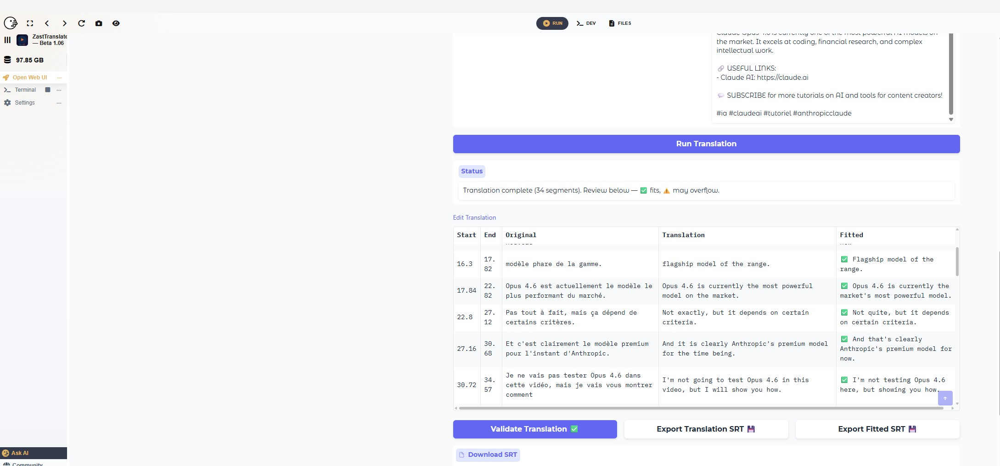
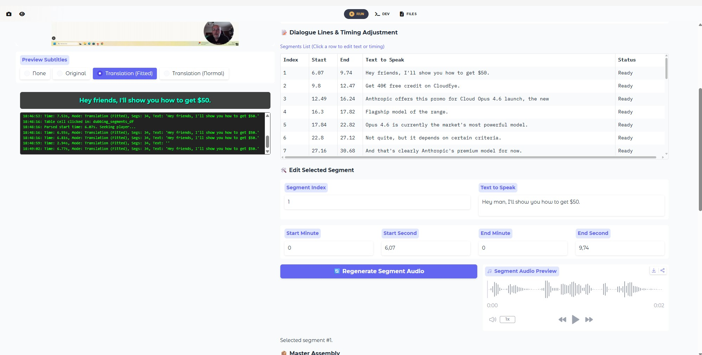
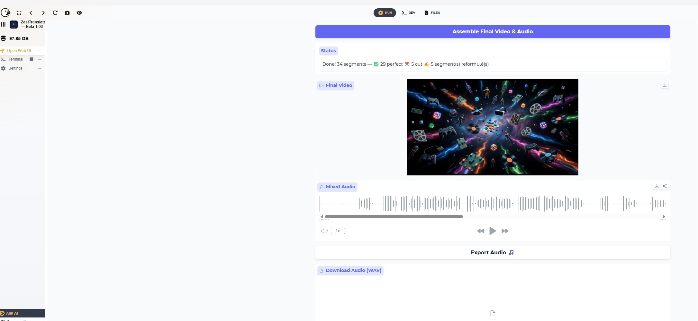
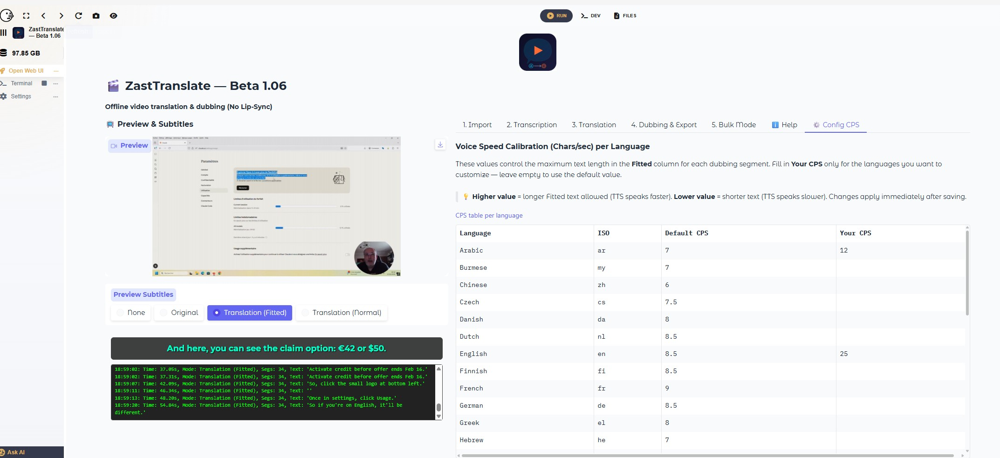
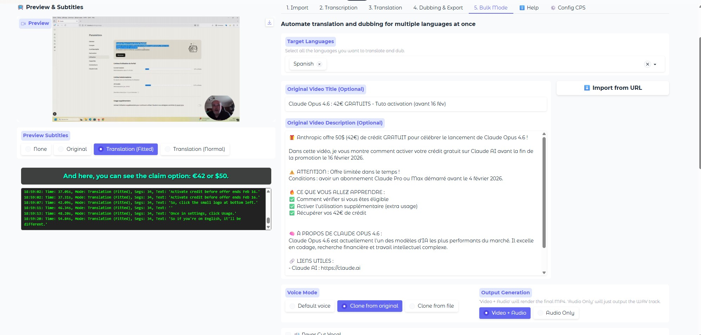

<p align="center">
  
</p>

# ZastTranslate — Beta 1.10

**1-click video translation & dubbing for [Pinokio](https://pinokio.computer)** — 100% local, AI voice cloning, zero API keys.

> ℹ️ **Beta 1.10**: Added interactive **YouTube SEO & Metadata Studio** with visible 4 hashtag packs, automatic YouTube Chapters generation from Wav2Vec2 subtitle timestamps, live YouTube search autocomplete trends discovery with tech disambiguation (0 API key), and seamless downstream translation pipeline. Tested on **Windows only**.

Translate any video into 33 languages with natural-sounding dubbed audio. Optionally clone the original speaker's voice for seamless dubbing. Everything runs locally on your machine — no cloud, no subscriptions.

## Features

- 🎬 **Input**: YouTube URL (with resolution picker), local video, or local audio file (MP3, WAV, etc.)
- 🎙️ **Transcription**: WhisperX with word-level timestamps — 20+ source languages
- 🌍 **Multi-Backend Translation**: Choose between Qwen2.5-7B, Qwen3.5-9B, or EuroLLM-9B
- 🗣️ **Voice Synthesis**: Powered by **VoxCPM 2** — 30 languages, per-language CPS calibration, with a dynamic factory ready to accept future engines.
- 🎙️ **Voice Cloning**: Zero-shot voice cloning from original audio or uploaded sample
- 🔊 **Smart Dubbing**: Auto-adjusts text length & speech speed to match original timing
- 🎵 **Audio Separation**: Demucs isolates vocals from background music/FX, then remixes with dubbed voice
- 🚀 **Bulk Mode**: Translate, dub, and export to multiple languages automatically in one single click
- 📝 **Editable**: Review and edit transcription & translation before dubbing
- 📦 **Export**: Final MP4 video + SRT subtitles
- 🗑️ **Cleanup**: "New Project" deletes all temporary files to free disk space

### Current limitations

- 🎭 **No lip-sync** — The dubbed audio replaces the original voice track but the video is not modified (no face/lip adaptation)
- 🗣️ **Single voice only** — All segments are dubbed with the same voice. Multi-speaker support is not available yet

## Installation (Pinokio)

1. Open **Pinokio**
2. Navigate to this repository
3. Click **Install** — sets up Python environment, PyTorch CUDA, VoxCPM 2 voice cloning, and all dependencies
4. Click **Start** — launches the Gradio web interface

## Usage

### 📺 Preview & Subtitles Panel (Left Column)

ZastTranslate's user interface is split into two columns: the **Persistent Preview Panel** on the left, and the **Action Tabs** on the right. 

The Left Column provides interactive controls that sync with your workflow tabs:
- **Video & Audio Player Preview** — Displays the uploaded or downloaded video/audio file.
- **Preview Subtitles** — Toggle subtitle overlays directly on top of the player in real-time. Choose between:
  - `None` — No subtitles.
  - `Original` — Transcribed text from Step 2.
  - `Translation (Fitted)` — Concise translation text for dubbing from Step 3.
  - `Translation (Normal)` — Full translation text from Step 3.
- **Dynamic Subtitle Overlay Box** — Renders subtitles in real-time, synchronized with the video player's playhead position.
- **Seek-on-Click Row Navigation** — Click on any dialogue row in the Transcription, Translation, or Dialogue lists to instantly jump the video/audio player playhead to the start time of that segment.
- **JS Debug Log** — Displays Svelte/Gradio communication logs for monitoring media player playback states.

---

### Step 1 — Import

Load your video from one of two sources:

- **YouTube URL** — Paste any YouTube link. The video is downloaded automatically.
- **Local file** — Upload a video from your computer. Supported formats: **MP4, MKV, AVI, MOV, WebM**.


> 💡 iPhone videos (.MOV with HEVC codec) are fully supported — they're automatically converted for browser playback.

### Step 2 — Transcription

This step separates vocals from background music (Demucs), then transcribes the speech (WhisperX).

| Option | Description |
|---|---|
| **Source Language** | Select the spoken language, or leave on *Auto* for detection. Manual selection improves accuracy. |
| **Whisper Model** | `base` (fast), `small`/`medium` (balanced), `large-v3` (best accuracy, ~3 GB VRAM) |


After transcription, review and edit the table (Start, End, Text).

> ⚠️ **You must click "Validate Transcription" before going to the Translation tab.** Without validation, the next step will not have any data.

You can also **import an existing SRT file** instead of running transcription.

#### 🚀 YouTube SEO & Description Studio (Chapters, Hashtags & Tags)

Under the transcription table, the built-in **YouTube SEO & Description Studio** generates high-ranking, publication-ready metadata calibrated to top YouTube ranking criteria (vidIQ / TubeBuddy 100/100 guidelines):

- **📌 Front-Loaded High-CTR Titles**: Focuses on the primary search intent and exact product/tool name within the first words with natural sentence casing and brand normalizations (*Hermès Agent*, *Windows*, *IA*, *API*, *ChatGPT*).
- **⏱️ Full-Duration Timeline Chapters & Landmark Detection**: Uniformly analyzes the entire video from `00:00` to the very last second. Automatically detects major technical landmarks (*Ollama*, *Qwen Local LLM*, *Telegram Bots*, *Smartphone Remote Control*, *API Setup*, *Automated Jobs*) and generates clean, well-spaced timestamped chapters (1 to 3 minutes between milestones).
- **📝 High-Retention Clean Descriptions (300+ words)**: Formatted strictly with zero markdown asterisks (`**`) so you can copy and paste directly into YouTube Studio without broken formatting. Includes an engaging search-focused hook (under 150 chars), rich feature breakdown, chapters list, link references, and call to action.
- **🏷️ 4 Strategic Hashtag Packs (Live UI Visibility & 1-Click Switching)**:
  1. `Pack 1 (Subject & Tool)`: Targets direct brand and tool searches (`#HermesAgent #IA #IntelligenceArtificielle #OpenSource #Windows`).
  2. `Pack 2 (Format & Tutorial)`: Targets learners and intent queries (`#HermesAgent #Tutoriel #GuideComplet #Installation #Avis #Test`).
  3. `Pack 3 (Tech Stack & Ecosystem)`: Targets local developers and technical communities (`#HermesAgent #Ollama #Qwen #LocalLLM #Telegram #Automation`).
  4. `Pack 4 (Trends & Suggested Videos)`: Piggybacks on YouTube's algorithmic homepage recommendations (`#HermesAgent #Innovation #Dev #Tendance #AIAgent #ChatGPT`).
- **🔍 Live YouTube Autocomplete Search Suggestion Mining**:
  - Automatically queries Google's public YouTube search suggestion endpoint (`https://suggestqueries.google.com/complete/search?client=firefox&ds=yt&q=...`) in real-time (0 API key required).
  - Retrieves the **exact search terms real users are typing right now** on YouTube, sorted by popularity and search volume.
  - Applies **smart semantic disambiguation** and a domain blacklist to purge unrelated fashion or clothing homonyms for tech subjects.
- **🎯 Long-Tail Tags Pool**: Combines live YouTube suggestions with high-CTR modifier patterns (`tuto ...`, `installation ... windows`, `test ...`, `avis ...`) formatted ready for YouTube Studio's tag box.
- **📥 One-Click Metadata Sync**: Click **"Apply to Translation & Bulk Metadata"** to immediately forward the generated title and description to Tab 3 (Single Translation) and Tab 5 (Bulk Mode) for multi-language localization.

### Step 3 — Translation

Select the target language and click **Run Translation**. The app generates two versions:

- **Translation** — Natural, full translation (faithful to the original meaning)
- **Fitted** — Concise version shortened to fit segment duration for dubbing (✅ = fits, ⚠️ = may overflow)




Both columns are editable. The **Fitted** column is what will be spoken during dubbing.

> ⚠️ **You must click "Validate Translation" before going to the Dubbing tab.** Without validation, dubbing will not work.

**Export options:** Export Translation SRT (full) or Export Fitted SRT (dubbing-ready).

**Supported languages:** The dropdown automatically updates based on the **intersection** of the capabilities of the selected **TTS Backend** (Tab 1) and **LLM Backend** (Tab 2).
For example:
- **TTS:** VoxCPM 2 supports 30 languages (Arabic, Burmese, Chinese, Danish, Dutch, English, Finnish, French, German, Greek, Hebrew, Hindi, Indonesian, Italian, Japanese, Khmer, Korean, Lao, Malay, Norwegian, Polish, Portuguese, Russian, Spanish, Swahili, Swedish, Tagalog, Thai, Turkish, Vietnamese).
- **LLM:** Qwen2.5/3.5 support all languages. EuroLLM supports only European languages.
If you combine EuroLLM (European) with VoxCPM 2, only the European languages supported by both will be available.

### Step 4 — Dubbing & Export

Generate the dubbed video with synthesized speech.



#### 📝 Interactive Segment Editor & Timeline Adjustments

Under the main dialogue segments table, a specialized **Segment Editor Card** opens when you select a segment row:
- **Seek-on-Click**: Clicking on any dialogue segment row instantly jumps the video/audio player playhead to the segment's starting time.
- **Timing Calibration**: You can adjust the **Start time** and **End time** (in minutes and seconds) of the selected segment to fine-tune the synchronization.
- **Text Editing**: Edit the dialogue text of the segment directly. If using *Fitted Translation*, editing the text will immediately update the dubbing TTS script.
- **🔄 Regenerate Segment Audio**: Re-synthesize the voice for the selected segment only and update the local cache immediately on disk. This allows you to iteratively test and tune specific lines without reprocessing the whole video.
- **⚠️ Reformulation Warning**: If a segment is shortened or reformulated by the translation LLM to fit timing constraints during synthesis, the editor card displays a warning icon ⚠️ and the exact shortened text so you can review it.


### Voice modes

| Mode | Description | When to use |
|---|---|---|
| **Default voice** | Uses the video's original voice as reference | Quick dubbing without manual sample |
| **Clone from original** | Clones the speaker's voice from the extracted vocals | Best result — sounds like the original speaker |
| **Clone from file** | Uses an uploaded WAV/MP3 file as voice reference | When you want a specific voice (10-30s of clear speech) |

> 💡 Voice cloning uses **VoxCPM 2**, installed automatically during setup.

**🔊 Never Cut Vocal** mode speaks all text in full without truncation. Produces more natural speech but dubbing may drift out of sync with the video.

**Output:** Final dubbed MP4 video + mixed audio (downloadable as WAV).


### ⚙️ Config CPS — Voice Speed Calibration

The **Config CPS** tab lets you tune the characters-per-second (CPS) speaking rate used to compute maximum Fitted text length per segment.

| Column | Description |
|---|---|
| **Language** | Display name |
| **ISO** | ISO 639-1 code |
| **Default CPS** | Built-in calibrated value |
| **Your CPS** | Your override — leave empty to use the default |

Click **Save** to apply immediately (no restart required). Click **Reset to defaults** to clear all overrides.

### Step 5 — Bulk Mode

Automate the translation and dubbing process for multiple languages down to a single click!

1. After validating the transcription in **Tab 2**, switch directly to **Tab 5**.
2. Select all the target languages you want from the dropdown list.
3. *(Optional)* Fill in the **Original Video Title** and **Description**. The AI will translate them into every selected language and display them on-screen for easy copy-pasting.
4. Choose your voice options (whether to clone or not, etc.).
5. Choose your output generation mode: 
   - **Video + Audio**: Generates the final MP4 dubbed videos, WAV audio tracks, and translated SRTs.
   - **Audio Only**: Generates the WAV mixed audio tracks and SRTs (faster if you don't need video rendering).
   - **Subtitles & Metadata Only**: Skips voice synthesis completely! Generates translated `.srt` subtitles (Natural & Fitted), localized video titles, and descriptions for all selected languages in seconds, packaged in a single `.zip` archive.
6. Click **Run Bulk Process** and wait. The software will process each language sequentially.

> ⚡ **Ultra-Fast Subtitles & Metadata Mode**: When choosing "Subtitles & Metadata Only", voice cloning and audio mixing are bypassed, allowing you to generate multi-language YouTube subtitle packages and SEO descriptions in under 15 seconds!




### 🔴 Publish to YouTube (Bulk Mode only) — *OPTIONAL FEATURE* ⚠️ EXPERIMENTAL (may crash)

ZastTranslate can automatically upload your generated translations and subtitles directly to your YouTube channel! **This feature is 100% optional and experimental — it may crash or behave unexpectedly. If you do not configure it, the application will continue to generate your files locally without any issue.**

**"Developer / Bring Your Own Key" method (recommended for this tool):**
1. Go to the Google Cloud Console.
2. Enable the YouTube Data API v3 for free.
3. Download a `client_secret.json` file and place it in the ZastTranslate folder.
4. The application will open a browser page asking: "ZastTranslate wants to access your channel, do you authorize?"
5. Click Yes — the app will obtain a secure access token (one-time setup).

**How to use it:**
Once configured, whenever you import a video using a YouTube URL, the **Bulk Mode** tab will display a red "Publish Metadata & Subtitles to YouTube" button. 
Clicking it will open a secure browser window asking you to authorize the application (you only need to do this once). It will then automatically update your video's localized titles, descriptions, and upload the translated `.srt` files as subtitle tracks.

> ⚠️ **Note on Audio:** YouTube's API does not currently support uploading dubbed audio tracks (Multi-language Audio). You will still need to drag and drop the generated `.wav` files manually in the YouTube Studio interface.

### ℹ️ Help tab

The built-in Help tab provides detailed usage instructions, troubleshooting tips, and system information.


## Requirements

- **GPU**: NVIDIA GPU with 4+ GB VRAM recommended (CUDA)
- **CPU**: Works on CPU but significantly slower
- **Disk**: ~8 GB for models (downloaded on first use)
- **OS**: **Tested on Windows only**. May work on Linux/macOS but untested.

## API (Programmatic Access)

### Python

```python
from modules.transcriber import Transcriber
from modules.seo_assistant import YouTubeSEOAssistant
from modules.reformulator import Reformulator
from modules.tts_engine import TTSEngine

# 1. Transcribe audio with WhisperX + Wav2Vec2 word alignment
transcriber = Transcriber(model_size="large-v3")
result = transcriber.transcribe("video.mp4", language="fr")
segments = result["segments"]

# 2. Generate YouTube SEO Kit (Title, Chapters, 4 Hashtags Packs, Description, Tags)
seo = YouTubeSEOAssistant()
seo_kit = seo.generate_full_seo_package(
    segments,
    current_title="Dragon Ball Nikolatoy",
    source_lang="fr"
)
print("Title:", seo_kit["title"])
print("Chapters:\n", seo_kit["chapters"])
print("Tags:", seo_kit["tags"])

# 3. Translate & Fit subtitles to timing in one pass
reformulator = Reformulator(backend_name="Qwen2.5-7B-Instruct")
reformulator.load_model()
translated = reformulator.translate_segments(
    segments, 
    source_lang="French",
    target_lang_name="English", 
    target_lang_code="en", 
    cps=15.0
)

# 4. Synthesize with zero-shot voice cloning
tts = TTSEngine()
tts.load_model(voice_path="vocals.wav")
result = tts.synthesize_segment("Hello world", "en", "output.wav", voice_path="vocals.wav")
```

### JavaScript (Node.js / Web Fetch)

```javascript
// Query Gradio API endpoints programmatically
async function translateVideo() {
  const response = await fetch("http://localhost:7860/api/predict", {
    method: "POST",
    headers: { "Content-Type": "application/json" },
    body: JSON.stringify({
      data: [
        "https://www.youtube.com/watch?v=XPLE57E7OBM",
        "English"
      ]
    })
  });
  const data = await response.json();
  console.log("Translation Result:", data);
}
translateVideo();
```

### cURL

```bash
# Query the live ZastTranslate server
curl -X POST http://localhost:7860/api/predict \
  -H "Content-Type: application/json" \
  -d '{"data": ["https://youtube.com/watch?v=XPLE57E7OBM"]}'
```

## Troubleshooting

### ⚠️ Cannot Upgrade to 0.91 (Divergent branches / Numpy Pip error)
If you installed ZastTranslate v0.9 from GitHub and the **Upgrade** button fails with a `divergent branches` or `numpy` conflict error, your local update script is outdated.
**How to fix:**
1. Delete ZastTranslate from your Pinokio home screen (click the 🗑️ icon).
2. Go to **Discover** or use the search bar to reinstall the app.
3. The new installation comes with the fixed updater, and you will never encounter this error on future updates.

- **Models download on first run** — WhisperX, Qwen3-8B, Demucs, and TTS models are cached in HuggingFace's default cache directory
- **Out of VRAM**: Models are loaded/unloaded sequentially to minimize memory usage
- **Clean install**: Click **Reset** then **Install** to start fresh

### Harmless terminal warnings

These messages appear in the terminal but **do not affect functionality** and can be safely ignored:

| Warning | Explanation |
|---|---|
| `Could not load libtorchcodec` | TorchCodec / FFmpeg DLL compatibility message. Long traceback but no impact on the app. |
| `Video does not have browser-compatible container or codec` | Gradio auto-converts iPhone MOV/HEVC videos to MP4 for browser playback. |
| `ConnectionResetError [WinError 10054]` | Harmless Windows networking warning from the Gradio server. |

## Author

- 🌐 [zast57.com](https://zast57.com) — Website
- 🤓 [paradoxetemporel.fr](https://paradoxetemporel.fr) — Tech & Geek blog
- 🎬 [zast.fr](https://zast.fr) — YouTube channel

## Credits

- [WhisperX](https://github.com/m-bain/whisperX) — Speech recognition & transcription
- [Qwen2.5-7B-Instruct](https://huggingface.co/Qwen/Qwen2.5-7B-Instruct) — LLM backend (text fitting & reformulation)
- [Qwen3.5-9B](https://huggingface.co/Qwen/Qwen3.5-9B) — LLM backend (text fitting & reformulation)
- [EuroLLM-9B-Instruct](https://huggingface.co/utter-project/EuroLLM-9B-Instruct) — LLM backend (European languages)
- [VoxCPM 2](https://huggingface.co/openbmb/VoxCPM2) (openbmb/VoxCPM2) — TTS & voice cloning (30 languages)
- [Demucs](https://github.com/facebookresearch/demucs) — Audio source separation
- [Gradio](https://gradio.app/) — Web interface
- [Pinokio](https://pinokio.computer/) — 1-click launcher

## License

MIT

## History

- **Beta 1.10**
  - **✨ Interactive YouTube SEO & Metadata Studio**: Auto-generates high-CTR search-intent video titles (natural sentence casing, front-loaded keywords, brand capitalization for *Hermès Agent*, *Windows*, *IA*, *API*, *ChatGPT*).
  - **⏱️ Full-Duration Uniform Chapter Generator**: Samples the entire video timeline from `00:00` to the very end (fixing early cutoffs on long 20+ min videos) and applies intelligent spacing rules (1 to 3 min between major milestones).
  - **🎯 Technical Landmark & Tool Detector**: Automatically scans transcript cues for key tool integrations (*Ollama*, *Qwen Local LLM*, *Telegram Bot*, *Smartphone Remote Control*, *API Configuration*, *Automated Jobs*) and generates dedicated, named timestamped chapters for each major feature.
  - **⚡ Subtitles & Metadata Only Bulk Mode**: Added a dedicated output generation mode in Bulk Mode allowing creators to generate translated SRT subtitles (Natural & Fitted), localized titles, and descriptions across multiple languages in under 15 seconds without running voice synthesis or video rendering.
  - **📝 Rich Plain-Text Descriptions (300+ words)**: Formatted strictly without markdown asterisks (`**`) for clean, direct copy-pasting to YouTube Studio, complete with hook, overview, bullet points, resources, and call to action.
  - **🏷️ 4 Thematic Hashtag Packs with UI Visibility**: Displays the exact hashtags directly on the interactive radio choices (*Subject & Tool*, *Format & Tuto*, *Tech & Ecosystem*, *Trends & Dev*) with instant description switching.
  - **🔍 Smart Search Trend Disambiguation**: Queries live YouTube Autocomplete without homonym pollution (excludes fashion/clothing keywords for tech subjects).
  - **🧹 Filler & Hesitation Removal in Translation**: Refactored translation prompts to eliminate false starts and verbal stammers (*"one time, well, every time"* -> fluent, natural idiomatic target phrasing).
  - **🎨 Universal Ergonomic Scrollbars**: Applied custom styled scrollbars and vertical resize handles across all textboxes, tables, markdown outputs, and file lists.
- **Beta 1.09**
  - **YouTube SEO & Description Studio**: Added a dedicated interactive studio in the Transcription tab (`modules/seo_assistant.py`) allowing creators to instantly generate complete YouTube publishing kits from their subtitle stream and live trending data.
  - **Automatic YouTube Chapters Generation**: The LLM analyzes the Wav2Vec2 timestamped subtitle cues to automatically extract topic shifts and output YouTube-compliant chapter timecodes (`00:00 - Introduction`, `MM:SS - Chapter Title`).
  - **Live YouTube Trending Keyword Suggestions**: Integrated live YouTube Autocomplete search discovery (zero API key required) to identify high-volume search queries and enrich generated video tags and titles.
  - **Thematic Hashtag Packages**: Offers 4 distinct targeted hashtag packages (Subject-Specific, General Tech/AI, Local Hardware/LLM, and Productivity/Automation) with 1-click selection and real-time description updates.
  - **Seamless Downstream Translation & Bulk Metadata Pipeline**: Added a 1-click `📥 Appliquer aux Métadonnées` action that seamlessly populates `state.video_info`, Single Translation (`original_title_input`, `original_desc_input`), and Bulk Mode (`bulk_title_input`, `bulk_desc_input`), ensuring generated descriptions and titles are automatically translated across all target languages.
- **Beta 1.08**
  - **NVIDIA RTX 50-Series Support (Blackwell / `sm_120`)**: Upgraded PyTorch backend to CUDA 12.8 (`cu128`), introducing full native support for NVIDIA GeForce RTX 5070, RTX 5070 Ti, RTX 5080, and RTX 5090 GPUs (compute capability `sm_120`), resolving `CUDA capability sm_120 is not compatible` errors during Demucs audio separation and model inference.
  - **WhisperX AI & Tech Context Priming (`initial_prompt`)**: Injected a comprehensive AI/tech domain context prompt (`Claude.ai`, `ChatGPT`, `Anthropic`, `Pinokio`, `Midjourney`, etc.) combined with imported video titles into WhisperX's autoregressive decoder. This eliminates phonetic acoustic hallucinations (such as transcribing "Claude.ai" as "CloudEye").
  - **Tech Brand & Phonetic Normalizer**: Added automatic phonetic brand repair in `modules/srt_cleaner.py` and `modules/transcriber.py` to seamlessly normalize AI/tech company names and preserved domain formatting (`.ai`, `.com`).
  - **Hardened Subprocess Environment Routing**: Switched Demucs execution in `modules/separator.py` to use `sys.executable -m demucs`, ensuring reliable execution under all Windows virtual environment configurations.
- **Beta 1.07**
  - **Professional Subtitle Cleaning**: Added `modules/srt_cleaner.py` to automatically filter out conversational filler words and oral tics ("donc voilà", "alors en fait", "du coup", "euh", "so basically", "you know", etc.) while preserving strict millisecond-level word synchronization.
  - **Ergonomic TV & YouTube Line Wrapping**: Subtitles are now automatically split and balanced into standard broadcast constraints (max 40 characters per line, 2 lines max per cue, 1.0s minimum readability duration).
  - **Multi-Format Subtitle Export**: Direct export support for `.srt` (UTF-8 BOM), `.vtt`, and single-line `.sbv` (preventing YouTube Studio multi-line parser warnings).
  - **Transcription Clean Button**: Added a dedicated `🧹 Clean Fillers & Oral Tics` button in the Transcription editor to preview and apply instant subtitle polish before translation.
  - **Persistent Metadata Disk Storage**: Translated titles and descriptions are now automatically saved to disk (`output/metadata_translations.md` and `output/metadata_translations.json`) during Bulk and Single translations, and packaged inside the `bulk_export_all.zip` archive.
  - **Direct Explorer Folder Access**: Added `📂 Open Folder` buttons across all tabs (Transcription, Translation, Dubbing & Export, Bulk Mode) to instantly open the output directory in Windows Explorer without relying on browser download dialogs.
  - **YouTube Metadata Localization Engine**: Calibrated metadata translation prompts to generate high-CTR catchy titles, strictly preserve affiliate URLs/links, emojis, and social handles, and localize conceptual hashtags into native target equivalents while safeguarding tech brand names and acronyms (`#ChatGPT`, `#LLM`, `#SEO`).
  - **Full-Page Vertical Scroll Fix**: Added robust `overflow-y: auto !important` styling to Gradio containers, preventing scroll lock when managing large video descriptions or expanded dataframes.
- **Beta 1.06**
  - **Interactive Timeline Segment Editor**: Restructured main app layout into a two-column interface with a persistent preview column (video/audio players, interactive subtitle preview selectors, dynamic subtitle overlay) on the left, and action tabs on the right.
  - **Click-to-Seek row navigation**: Clicking on any dialogue segment row in the Transcription, Translation, or Dubbing lists instantly jumps the video player playhead to the segment's starting time.
  - **Single-Segment Synthesis & Timing Calibration**: Select a line in the dialogue lists to open the segment editor card, adjust text and start/end times in minutes and seconds, and re-synthesize that segment only (updating its cache on disk) without reprocessing the whole video.
  - **Reformulation Warnings & Count Tracking**: Added warnings showing if a segment was shortened/reformulated to fit time constraints, displaying a warn icon ⚠️ and the exact shortened text in the segment editor, plus total counts in the main synthesis status.
  - **Metadata Copy Buttons**: Integrated copy-to-clipboard icons directly inside the Translated Video Title and Description text fields.
- **Beta 1.05**
  - **Local Audio Support**: Added the ability to upload local audio files (MP3, WAV, M4A, etc.) in the Import tab.
  - **Adaptive Output & Layouts**: Toggles between video and audio player previews dynamically. If an audio file is imported, Dubbing and Export skips video packaging, and Bulk Mode automatically locks the output generation choice to "Audio Only".
- **Beta 1.04**
  - **Metadata Translation Prompt Fixes**: Resolved system instruction leakages in Russian and German metadata translations (Original Video Title and Description) by moving instruction rules entirely to the system role and passing only the raw text to the user role.
  - **Meta-Comment Cleaners**: Added fallback pattern-matching filters for translated headers and meta-comments (like `Перевод:` and `Übersetzung:`) to strip them automatically if generated.
- **Beta 1.03**
  - **Voice Cloning Stability**: Replaced indiscriminate 30s trimming with a surgical reference extraction strategy, choosing the cleanest 5-15s segment. Prevents artifacts and background noise during voice cloning.
  - **Persistent Default Voice**: Solved Voice Design hallucination where a new random voice was generated for every sentence when cloning was disabled. The system now caches a high-quality persistent default voice (`default_man.wav` or `default_woman.wav`).
  - **Voice Gender Selection**: Added UI option to select the gender (Man / Woman) for the Default Voice, working seamlessly in both Normal and Bulk modes.
- **Beta 1.02**
  - **Batch LLM Translation**: Translation now processes 8 segments simultaneously (vs. 1 before), cutting translation time by ~6×.
  - **VoxCPM 2 Speed**: Reference audio trimmed to 30 seconds before synthesis, reducing the LM KV cache from ~47,000 tokens to ~1,800 — 16–20× faster token generation.
  - **VoxCPM 2 Quality**: Denoiser (ZipEnhancer) re-enabled for cleaner audio output. `inference_timesteps` restored to default (10) for best DiT quality. CFG guidance restored to 2.0 (was accidentally set to 1.0, causing echo/garbling).
- **Beta 1.01**
  - **Per-Language CPS Calibration**: Replaced the single hardcoded 7.5 chars/sec with a per-language table (`fitted_cps_config.py`) covering 30+ languages across Latin, CJK, Cyrillic, Abjad, and Abugida scripts.
  - **Qwen3-TTS Removed**: VoxCPM 2 is now the sole TTS backend. Simpler stack, fewer dependencies.
- **Version 1.00**
  - **Consistent Default Voice**: VoxCPM 2 now automatically uses the video's isolated vocals as its default reference instead of generating random voices.
  - **Multi-Backend TTS Architecture**: Decoupled `tts_engine.py` into a modular `tts_backends/` structure. VoxCPM 2 natively supported, with an architecture ready to plug in future engines.
  - **Multi-Backend LLM Architecture**: Added `llm_backends/` supporting Qwen2.5-7B, Qwen3.5-9B, and EuroLLM-9B.
  - **Dynamic Language Intersection**: UI dropdowns automatically filter target languages based on the intersection of the selected TTS and LLM backends' capabilities.
  - **Memory Efficiency**: Backends are now loaded on-the-fly and cleanly unloaded from VRAM when switching models.
  - **Dynamic TimeSync**: Subtitle duration adjustments now adapt natively to the backend's specific features (speed instruct injection, native duration passing).
- **Version 0.98**
  - **YouTube API Integration (Optional)**: Added a "Publish to YouTube" button in Bulk Mode. By bringing your own `client_secret.json` from Google Cloud, ZastTranslate can now automatically push localized titles, descriptions, and subtitle tracks directly to your video.
  - **Auto-Fill Metadata**: In Bulk Mode, the Original Title and Description fields can now be populated automatically from the imported YouTube URL with a single click.
- **Version 0.97**
  - **Memory Optimization**: Added a "Keep models in memory" option for users with high VRAM (>16GB) to bypass unloading models between steps, dramatically speeding up workflows.
  - **Speed Acceleration**: Implemented native PyTorch SDPA (Scaled Dot Product Attention) for Qwen2.5-7B and Qwen3-TTS. This speeds up LLM and voice generation without complex compilation.
  - **Bug Fix**: Resolved a bug during SRT import where an "Auto" source language could incorrectly bypass English translations.
- **Version 0.96**
  - **Improved Formatting**: Metadata output in Bulk Mode is now displayed in convenient copy-paste text blocks.
  - **Translation Quality**: Fine-tuned the repetition penalty to produce more natural translations.
  - **Fixed Truncation**: Increased the max token limit for metadata translation to ensure long descriptions are fully translated without being cut off.
- **Version 0.95**
  - **Memory Optimization**: Completely refactored the Bulk Mode pipeline to process all translations before loading the TTS model, eliminating VRAM fragmentation and massive slowdowns.
  - **Metadata Translation**: Added optional fields in Bulk Mode to automatically translate the Video Title and Description into all target languages.
  - **Model Upgrade**: Switched the translation engine to `Qwen2.5-7B-Instruct` for flawless instruction following and zero translation bugs.
- **Version 0.91** 
  - Added Bulk Mode (generate multiple languages in one click).
- **Version 0.9** 
  - Initial release.

---

## 📡 API Documentation

ZastTranslate exposes a full programmatic API through Gradio Client, Python, JavaScript, and cURL.

### 1. Python (Gradio Client)

```python
from gradio_client import Client, handle_file

# Connect to local ZastTranslate instance
client = Client("http://127.0.0.1:7860/")

# 1. Import Video
import_res = client.predict(
    source_type="Local file",
    url="",
    file=handle_file("D:/videos/my_video.mp4"),
    youtube_resolution="best",
    api_name="/step1_import"
)
print("Import status:", import_res[1])

# 2. Run Transcription
trans_res = client.predict(
    lang_source="French",
    model_size="large-v3",
    api_name="/step2_transcribe"
)

# 3. Generate YouTube SEO Kit
seo_res = client.predict(
    transcription_df=trans_res[1],
    selected_pack="Pack 1 (Sujet & Outil)",
    lang_source="French",
    api_name="/step2_generate_seo_metadata"
)
print("SEO Title:", seo_res[0])
print("SEO Description:\n", seo_res[3])
```

### 2. JavaScript / TypeScript (@gradio/client)

```javascript
import { Client } from "@gradio/client";

async function runTranslation() {
  const app = await Client.connect("http://127.0.0.1:7860/");

  // Run Translation on current validated project
  const result = await app.predict("/step4_translate", [
    "English",
    "Tutoriel Hermès Agent : Guide complet sur Windows",
    "Description complète..."
  ]);

  console.log("Translation status:", result.data[0]);
}

runTranslation();
```

### 3. cURL (HTTP REST API)

```bash
# Check server status and available endpoints
curl http://127.0.0.1:7860/info

# Trigger SEO metadata generation via HTTP JSON POST
curl -X POST http://127.0.0.1:7860/api/predict/ \
  -H "Content-Type: application/json" \
  -d '{
    "fn_index": 12,
    "data": [
      null,
      "Pack 1 (Sujet & Outil)",
      "French"
    ]
  }'
```
