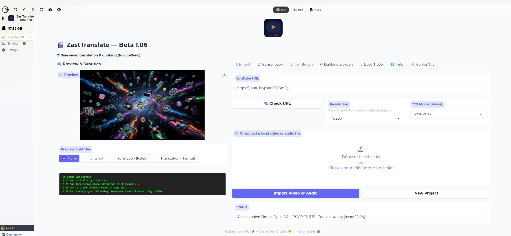
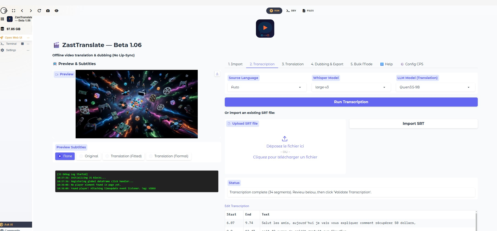
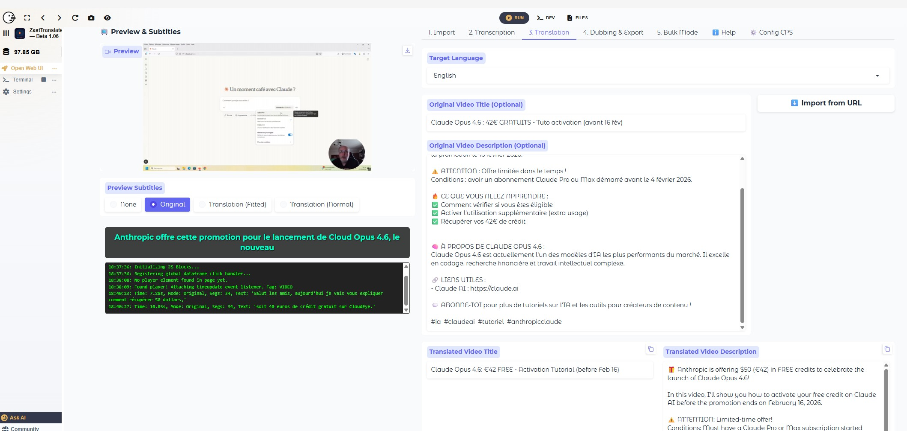
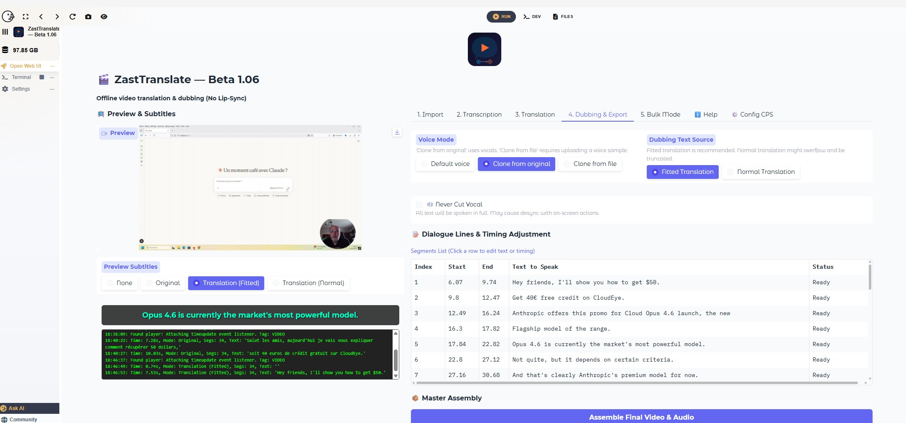
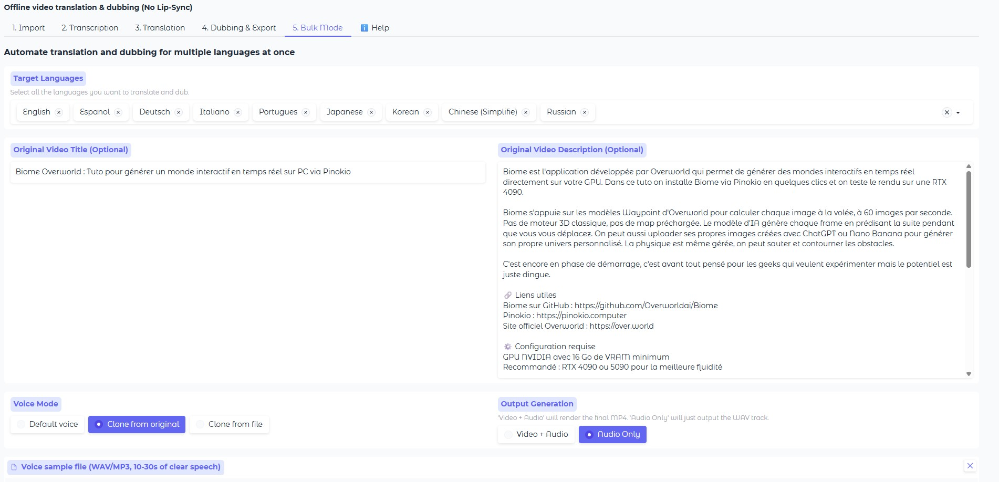
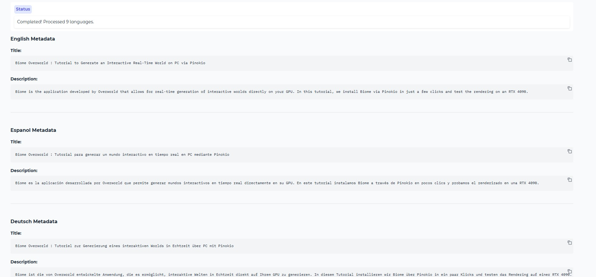
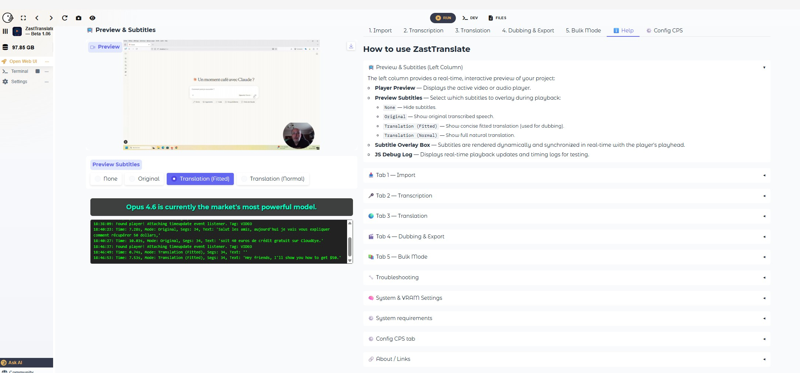

<p align="center">
  
</p>

# ZastTranslate — Beta 1.03

**1-click video translation & dubbing for [Pinokio](https://pinokio.computer)** — 100% local, AI voice cloning, zero API keys.

> ℹ️ **Beta 1.03**: Voice cloning stability improvements (surgical extraction), "Persistent Default Voice" to prevent Voice Design hallucinations, and a new option to select the Default Voice Gender (Man / Woman). Tested on **Windows only**. Some features may change.

Translate any video into 33 languages with natural-sounding dubbed audio. Optionally clone the original speaker's voice for seamless dubbing. Everything runs locally on your machine — no cloud, no subscriptions.

## Features

- 🎬 **Input**: YouTube URL (with resolution picker) or local video file
- 🎙️ **Transcription**: WhisperX with word-level timestamps — 20+ source languages
- 🌍 **Multi-Backend Translation**: Choose between Qwen2.5-7B, Qwen3.5-9B, or EuroLLM-9B
- 🗣️ **Voice Synthesis**: Powered by **VoxCPM 2** — 30 languages, per-language CPS calibration, with a dynamic factory ready to accept future engines.
- 🎙️ **Voice Cloning**: Zero-shot voice cloning from original audio or uploaded sample
- 🔊 **Smart Dubbing**: Auto-adjusts text length & speech speed to match original timing
- 🎵 **Audio Separation**: Demucs isolates vocals from background music/FX, then remixes with dubbed voice
- 🚀 **Bulk Mode**: Translate, dub, and export to multiple languages automatically in one single click
- 📝 **Editable**: Review and edit transcription & translation before dubbing
- 📦 **Export**: Final MP4 video + SRT subtitles
- 🗑️ **Cleanup**: "New Project" deletes all temporary files to free disk space

### Current limitations

- 🎭 **No lip-sync** — The dubbed audio replaces the original voice track but the video is not modified (no face/lip adaptation)
- 🗣️ **Single voice only** — All segments are dubbed with the same voice. Multi-speaker support is not available yet

## Installation (Pinokio)

1. Open **Pinokio**
2. Navigate to this repository
3. Click **Install** — sets up Python environment, PyTorch CUDA, VoxCPM 2 voice cloning, and all dependencies
4. Click **Start** — launches the Gradio web interface

## Usage

### Step 1 — Import

Load your video from one of two sources:

- **YouTube URL** — Paste any YouTube link. The video is downloaded automatically.
- **Local file** — Upload a video from your computer. Supported formats: **MP4, MKV, AVI, MOV, WebM**.



> 💡 iPhone videos (.MOV with HEVC codec) are fully supported — they're automatically converted for browser playback.

### Step 2 — Transcription

This step separates vocals from background music (Demucs), then transcribes the speech (WhisperX).

| Option | Description |
|---|---|
| **Source Language** | Select the spoken language, or leave on *Auto* for detection. Manual selection improves accuracy. |
| **Whisper Model** | `base` (fast), `small`/`medium` (balanced), `large-v3` (best accuracy, ~3 GB VRAM) |



After transcription, review and edit the table (Start, End, Text).

> ⚠️ **You must click "Validate Transcription" before going to the Translation tab.** Without validation, the next step will not have any data.

You can also **import an existing SRT file** instead of running transcription.

### Step 3 — Translation

Select the target language and click **Run Translation**. The app generates two versions:

- **Translation** — Natural, full translation (faithful to the original meaning)
- **Fitted** — Concise version shortened to fit segment duration for dubbing (✅ = fits, ⚠️ = may overflow)



Both columns are editable. The **Fitted** column is what will be spoken during dubbing.

> ⚠️ **You must click "Validate Translation" before going to the Dubbing tab.** Without validation, dubbing will not work.

**Export options:** Export Translation SRT (full) or Export Fitted SRT (dubbing-ready).

**Supported languages:** The dropdown automatically updates based on the **intersection** of the capabilities of the selected **TTS Backend** (Tab 1) and **LLM Backend** (Tab 2).
For example:
- **TTS:** VoxCPM 2 supports 30 languages (Arabic, Burmese, Chinese, Danish, Dutch, English, Finnish, French, German, Greek, Hebrew, Hindi, Indonesian, Italian, Japanese, Khmer, Korean, Lao, Malay, Norwegian, Polish, Portuguese, Russian, Spanish, Swahili, Swedish, Tagalog, Thai, Turkish, Vietnamese).
- **LLM:** Qwen2.5/3.5 support all languages. EuroLLM supports only European languages.
If you combine EuroLLM (European) with VoxCPM 2, only the European languages supported by both will be available.

### Step 4 — Dubbing & Export

Generate the dubbed video with synthesized speech.

### Voice modes

| Mode | Description | When to use |
|---|---|---|
| **Default voice** | Uses the video's original voice as reference | Quick dubbing without manual sample |
| **Clone from original** | Clones the speaker's voice from the extracted vocals | Best result — sounds like the original speaker |
| **Clone from file** | Uses an uploaded WAV/MP3 file as voice reference | When you want a specific voice (10-30s of clear speech) |

> 💡 Voice cloning uses **VoxCPM 2**, installed automatically during setup.

**🔊 Never Cut Vocal** mode speaks all text in full without truncation. Produces more natural speech but dubbing may drift out of sync with the video.

**Output:** Final dubbed MP4 video + mixed audio (downloadable as WAV).



### ⚙️ Config CPS — Voice Speed Calibration

The **Config CPS** tab lets you tune the characters-per-second (CPS) speaking rate used to compute maximum Fitted text length per segment.

| Column | Description |
|---|---|
| **Language** | Display name |
| **ISO** | ISO 639-1 code |
| **Default CPS** | Built-in calibrated value |
| **Your CPS** | Your override — leave empty to use the default |

Click **Save** to apply immediately (no restart required). Click **Reset to defaults** to clear all overrides.

### Step 5 — Bulk Mode

Automate the translation and dubbing process for multiple languages down to a single click!

1. After validating the transcription in **Tab 2**, switch directly to **Tab 5**.
2. Select all the target languages you want from the dropdown list.
3. *(Optional)* Fill in the **Original Video Title** and **Description**. The AI will translate them into every selected language and display them on-screen for easy copy-pasting.
4. Choose your voice options (whether to clone or not, etc.).
5. Choose your output: 
   - **Video + Audio**: Generates the final MP4 dubbed videos and the WAV audio tracks.
   - **Audio Only**: Generates only the WAV mixed audio tracks and SRTs (faster if you don't need videos).
6. Click **Run Bulk Process** and wait. The software will process each language sequentially.

> ⚡ **Memory Optimized**: In Bulk Mode, the pipeline translates ALL languages first, completely unloads the LLM, and then loads the Voice Synthesis AI. This prevents VRAM fragmentation and allows you to run massive multi-language batches efficiently even on an RTX 4090.





### 🔴 Publish to YouTube (Bulk Mode only) — *OPTIONAL FEATURE* ⚠️ EXPERIMENTAL (may crash)

ZastTranslate can automatically upload your generated translations and subtitles directly to your YouTube channel! **This feature is 100% optional and experimental — it may crash or behave unexpectedly. If you do not configure it, the application will continue to generate your files locally without any issue.**

**"Developer / Bring Your Own Key" method (recommended for this tool):**
1. Go to the Google Cloud Console.
2. Enable the YouTube Data API v3 for free.
3. Download a `client_secret.json` file and place it in the ZastTranslate folder.
4. The application will open a browser page asking: "ZastTranslate wants to access your channel, do you authorize?"
5. Click Yes — the app will obtain a secure access token (one-time setup).

**How to use it:**
Once configured, whenever you import a video using a YouTube URL, the **Bulk Mode** tab will display a red "Publish Metadata & Subtitles to YouTube" button. 
Clicking it will open a secure browser window asking you to authorize the application (you only need to do this once). It will then automatically update your video's localized titles, descriptions, and upload the translated `.srt` files as subtitle tracks.

> ⚠️ **Note on Audio:** YouTube's API does not currently support uploading dubbed audio tracks (Multi-language Audio). You will still need to drag and drop the generated `.wav` files manually in the YouTube Studio interface.

### ℹ️ Help tab

The built-in Help tab provides detailed usage instructions, troubleshooting tips, and system information.



## Requirements

- **GPU**: NVIDIA GPU with 4+ GB VRAM recommended (CUDA)
- **CPU**: Works on CPU but significantly slower
- **Disk**: ~8 GB for models (downloaded on first use)
- **OS**: **Tested on Windows only**. May work on Linux/macOS but untested.

## API (Programmatic Access)

### Python

```python
from modules.transcriber import Transcriber
from modules.reformulator import Reformulator
from modules.tts_engine import TTSEngine

# Transcribe
transcriber = Transcriber()
segments = transcriber.transcribe("video.mp4", language="en")

# Translate (Qwen2.5-7B-Instruct — translates + fits text to timing in one pass)
reformulator = Reformulator()
reformulator.load_model()
translated = reformulator.translate_segments(segments, source_lang="en",
    target_lang_name="French", target_lang_code="fra_Latn", cps=13)

# Synthesize with voice cloning
tts = TTSEngine()
tts.load_model(voice_path="reference_voice.wav")
result = tts.synthesize_segment("Bonjour le monde", "fra", "output.wav", voice_path="reference_voice.wav")
```

### cURL (Gradio API)

```bash
# When running, the Gradio API is available at the displayed URL
curl -X POST http://localhost:7860/api/predict \
  -H "Content-Type: application/json" \
  -d '{"data": ["https://youtube.com/watch?v=..."]}'
```

## Troubleshooting

### ⚠️ Cannot Upgrade to 0.91 (Divergent branches / Numpy Pip error)
If you installed ZastTranslate v0.9 from GitHub and the **Upgrade** button fails with a `divergent branches` or `numpy` conflict error, your local update script is outdated.
**How to fix:**
1. Delete ZastTranslate from your Pinokio home screen (click the 🗑️ icon).
2. Go to **Discover** or use the search bar to reinstall the app.
3. The new installation comes with the fixed updater, and you will never encounter this error on future updates.

- **Models download on first run** — WhisperX, Qwen3-8B, Demucs, and TTS models are cached in HuggingFace's default cache directory
- **Out of VRAM**: Models are loaded/unloaded sequentially to minimize memory usage
- **Clean install**: Click **Reset** then **Install** to start fresh

### Harmless terminal warnings

These messages appear in the terminal but **do not affect functionality** and can be safely ignored:

| Warning | Explanation |
|---|---|
| `Could not load libtorchcodec` | TorchCodec / FFmpeg DLL compatibility message. Long traceback but no impact on the app. |
| `Video does not have browser-compatible container or codec` | Gradio auto-converts iPhone MOV/HEVC videos to MP4 for browser playback. |
| `ConnectionResetError [WinError 10054]` | Harmless Windows networking warning from the Gradio server. |

## Author

- 🌐 [zast57.com](https://zast57.com) — Website
- 🤓 [paradoxetemporel.fr](https://paradoxetemporel.fr) — Tech & Geek blog
- 🎬 [zast.fr](https://zast.fr) — YouTube channel

## Credits

- [WhisperX](https://github.com/m-bain/whisperX) — Speech recognition & transcription
- [Qwen2.5-7B-Instruct](https://huggingface.co/Qwen/Qwen2.5-7B-Instruct) — LLM backend (text fitting & reformulation)
- [Qwen3.5-9B](https://huggingface.co/Qwen/Qwen3.5-9B) — LLM backend (text fitting & reformulation)
- [EuroLLM-9B-Instruct](https://huggingface.co/utter-project/EuroLLM-9B-Instruct) — LLM backend (European languages)
- [VoxCPM 2](https://huggingface.co/openbmb/VoxCPM2) (openbmb/VoxCPM2) — TTS & voice cloning (30 languages)
- [Demucs](https://github.com/facebookresearch/demucs) — Audio source separation
- [Gradio](https://gradio.app/) — Web interface
- [Pinokio](https://pinokio.computer/) — 1-click launcher

## License

MIT

## History

- **Beta 1.03**
  - **Voice Cloning Stability**: Replaced indiscriminate 30s trimming with a surgical reference extraction strategy, choosing the cleanest 5-15s segment. Prevents artifacts and background noise during voice cloning.
  - **Persistent Default Voice**: Solved Voice Design hallucination where a new random voice was generated for every sentence when cloning was disabled. The system now caches a high-quality persistent default voice (`default_man.wav` or `default_woman.wav`).
  - **Voice Gender Selection**: Added UI option to select the gender (Man / Woman) for the Default Voice, working seamlessly in both Normal and Bulk modes.
- **Beta 1.02**
  - **Batch LLM Translation**: Translation now processes 8 segments simultaneously (vs. 1 before), cutting translation time by ~6×.
  - **VoxCPM 2 Speed**: Reference audio trimmed to 30 seconds before synthesis, reducing the LM KV cache from ~47,000 tokens to ~1,800 — 16–20× faster token generation.
  - **VoxCPM 2 Quality**: Denoiser (ZipEnhancer) re-enabled for cleaner audio output. `inference_timesteps` restored to default (10) for best DiT quality. CFG guidance restored to 2.0 (was accidentally set to 1.0, causing echo/garbling).
- **Beta 1.01**
  - **Per-Language CPS Calibration**: Replaced the single hardcoded 7.5 chars/sec with a per-language table (`fitted_cps_config.py`) covering 30+ languages across Latin, CJK, Cyrillic, Abjad, and Abugida scripts.
  - **Qwen3-TTS Removed**: VoxCPM 2 is now the sole TTS backend. Simpler stack, fewer dependencies.
- **Version 1.00**
  - **Consistent Default Voice**: VoxCPM 2 now automatically uses the video's isolated vocals as its default reference instead of generating random voices.
  - **Multi-Backend TTS Architecture**: Decoupled `tts_engine.py` into a modular `tts_backends/` structure. VoxCPM 2 natively supported, with an architecture ready to plug in future engines.
  - **Multi-Backend LLM Architecture**: Added `llm_backends/` supporting Qwen2.5-7B, Qwen3.5-9B, and EuroLLM-9B.
  - **Dynamic Language Intersection**: UI dropdowns automatically filter target languages based on the intersection of the selected TTS and LLM backends' capabilities.
  - **Memory Efficiency**: Backends are now loaded on-the-fly and cleanly unloaded from VRAM when switching models.
  - **Dynamic TimeSync**: Subtitle duration adjustments now adapt natively to the backend's specific features (speed instruct injection, native duration passing).
- **Version 0.98**
  - **YouTube API Integration (Optional)**: Added a "Publish to YouTube" button in Bulk Mode. By bringing your own `client_secret.json` from Google Cloud, ZastTranslate can now automatically push localized titles, descriptions, and subtitle tracks directly to your video.
  - **Auto-Fill Metadata**: In Bulk Mode, the Original Title and Description fields can now be populated automatically from the imported YouTube URL with a single click.
- **Version 0.97**
  - **Memory Optimization**: Added a "Keep models in memory" option for users with high VRAM (>16GB) to bypass unloading models between steps, dramatically speeding up workflows.
  - **Speed Acceleration**: Implemented native PyTorch SDPA (Scaled Dot Product Attention) for Qwen2.5-7B and Qwen3-TTS. This speeds up LLM and voice generation without complex compilation.
  - **Bug Fix**: Resolved a bug during SRT import where an "Auto" source language could incorrectly bypass English translations.
- **Version 0.96**
  - **Improved Formatting**: Metadata output in Bulk Mode is now displayed in convenient copy-paste text blocks.
  - **Translation Quality**: Fine-tuned the repetition penalty to produce more natural translations.
  - **Fixed Truncation**: Increased the max token limit for metadata translation to ensure long descriptions are fully translated without being cut off.
- **Version 0.95**
  - **Memory Optimization**: Completely refactored the Bulk Mode pipeline to process all translations before loading the TTS model, eliminating VRAM fragmentation and massive slowdowns.
  - **Metadata Translation**: Added optional fields in Bulk Mode to automatically translate the Video Title and Description into all target languages.
  - **Model Upgrade**: Switched the translation engine to `Qwen2.5-7B-Instruct` for flawless instruction following and zero translation bugs.
- **Version 0.91** 
  - Added Bulk Mode (generate multiple languages in one click).
- **Version 0.9** 
  - Initial release.
